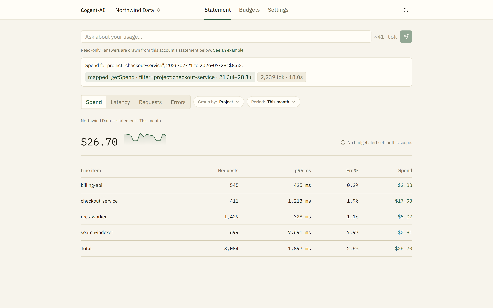
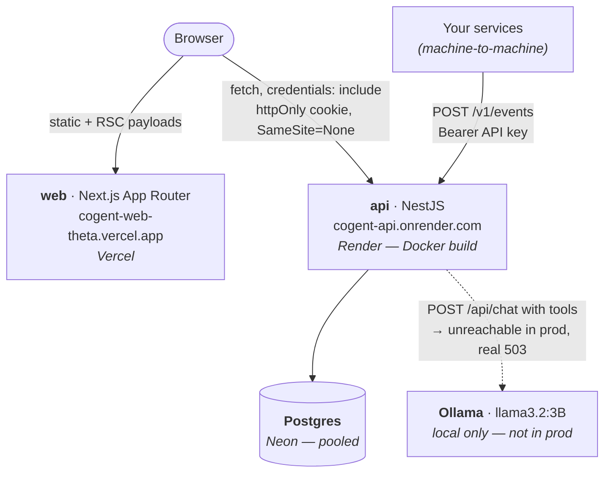

# Cogent-AI

A multi-tenant LLM cost and observability platform — ingest usage events from your services, read them back as an itemized **statement**, set budget alerts, and ask questions about your spend in plain English. The natural-language assistant is the point of the project: an LLM that maps a question onto a closed set of allow-listed query functions, with tenant isolation and a compute ceiling that hold *by construction* rather than by prompt instruction.

Every significant decision is backed by an [ADR](./docs/adr/README.md) that names what it rejected and why — including one that records, in a dated amendment, that its own central premise turned out to be wrong.



*Captured against the real local stack with a live Ollama daemon — the answer, the `mapped:` provenance tag, and the `2,239 tok · 18.0s` usage meter are all real output, not mocked. Full walkthrough: [`docs/demo-walkthrough.md`](./docs/demo-walkthrough.md).*

## Live deployment

| Service | URL |
|---|---|
| Web (Next.js) | https://cogent-web-theta.vercel.app |
| API (NestJS) | https://cogent-api.onrender.com |
| Database | Neon (managed Postgres) |

Sign up to create an org — signup *is* tenant creation, and the org you create is yours alone. Render's free tier spins down when idle, so the first request after a quiet period takes 10–15s to cold-start.

**The NL-query assistant deliberately shows its real "Couldn't reach the query service" state on the public deploy.** No LLM runs in production: the assistant needs a local Ollama daemon, no free-tier host can run one (RAM floor, plus idle-suspend making every real visitor pay the measured 42–74s cold-load), and this project runs no paid APIs anywhere. That trade is argued in full in [ADR-0005](./docs/adr/0005-deploy-topology-and-the-production-ollama-boundary.md) — the assistant works end-to-end locally, and the deploy shows the honest boundary rather than faking it.

## Architecture

Full deep-dive, including the request lifecycle and the assistant's guardrail pipeline: [`docs/architecture.md`](./docs/architecture.md). Summary:

```
apps/
  api        NestJS — auth, ingestion, usage aggregation, budgets, the NL-query assistant
  web        Next.js (App Router) — Statement, Budgets, the ask bar and answer log
packages/
  sdk        Reserved for a published ingestion client — currently an empty stub
  ui         Reserved for extracted shared components — currently an empty stub
docs/
  adr/       Architecture decision records — start at the index
```

`packages/sdk` and `packages/ui` are scaffolded workspace stubs (`export {}`) that nothing imports yet. They're named here so the tree isn't misread as more than it is.

**Deployed topology** — three managed services, one of which the browser never talks to directly:



The browser calls the API directly — nothing is proxied through Next. That makes web and API genuinely **cross-site**, which is why both auth cookies carry `SameSite=None; Secure` in the deployed environment (see below).

### The decisions that matter

- **Tenant isolation is enforced at the query layer, not the route.** Every data-access function takes a `TenantScope` as a mandatory first parameter, constructed *only* by the token verifier — `OrgId` is a branded type, so passing `req.body.orgId` where a scope is expected is a compile error. No request DTO has an `orgId` field to populate. The reason it lives at the query layer rather than in a route guard isn't that guards are bypassable — it's that **the assistant is a non-HTTP caller of the data layer**, so an HTTP-layer check wouldn't cover the feature the product exists to demonstrate. [ADR-0001](./docs/adr/0001-hand-rolled-jwt-and-org-scoped-rbac.md)
- **Auth is hand-rolled and hybrid, not "stateless JWT".** A 15-minute HS256 access token (signature-only, hot path) plus an opaque, database-backed, rotating refresh token with reuse detection — present a consumed token and the whole family is revoked. Refresh re-reads the membership row and re-derives `org`/`role` from the database rather than copying claims forward, so demotion and removal take effect within one refresh interval without any denylist. The ≤15-minute revocation window is documented as an accepted residual with the escalation path named, not hidden. [ADR-0001](./docs/adr/0001-hand-rolled-jwt-and-org-scoped-rbac.md)
- **Money is integer micro-dollars end to end.** `SUM` over integers, no float rounding, on a number whose entire claim is an accurate bill. [ADR-0002](./docs/adr/0002-usage-event-persistence-single-path-ingestion-and-named-aggregation-layer.md)
- **DynamoDB was rejected, deliberately.** Postgres with named aggregation functions, plus a written ADR explaining why not — choosing *not* to add a database is the judgment signal, not adding one. [ADR-0002](./docs/adr/0002-usage-event-persistence-single-path-ingestion-and-named-aggregation-layer.md)
- **Ingestion is one synchronous path with its own credential type.** `POST /v1/events` authenticates with a Bearer API key minted at signup (machine-to-machine, no human session), and resolves the org from the key — never from the payload. The SQS-backed async design, and the `201`→`202` contract change it would force, is designed but not built. [ADR-0002](./docs/adr/0002-usage-event-persistence-single-path-ingestion-and-named-aggregation-layer.md)

## The NL-query assistant

The differentiator, and the part worth reading the ADRs for. [ADR-0003](./docs/adr/0003-nl-query-guardrails.md) sets the shape; [ADR-0004](./docs/adr/0004-nl-query-assistant-function-calling-intent-and-cost-cap.md) builds the binding.

- **The allow-list *is* the tool set.** The model is handed exactly five tools — four metric functions (`getSpend`, `getRequestVolume`, `getLatency`, `getErrorRate`) and one control tool (`report_out_of_scope`). Their schemas are projections of the same Zod schemas the HTTP API validates against. The server owns the `(function, args) → parameterized query` mapping; there is no code path where model output becomes SQL. The one free-text argument the model controls (`filter.value`) reaches the database as a bound parameter, so it can pick *which rows*, never *what query*.
- **The model has no `orgId` to get wrong.** Scope comes from the verified credential, applied inside the repository. A prompt injection can at most steer the model to a different *in-scope* query — visible in the `mapped:` tag on every answer, and correctable by the user. That's the accepted residual, named as such.
- **`intent` is derived server-side.** `groupBy` present ⇔ `slice`; absent ⇔ `point`. The model can't assert an intent, so a mis-set discriminator can't silently mis-route the UI. A `slice` answer re-scopes the statement below it — visible in the [walkthrough](./docs/demo-walkthrough.md).
- **Answers are templated deterministically, not generated.** One model call maps the question; the figure is rendered by a server-side template over the real query result. Handing a bill to an LLM to phrase reintroduces the one thing a cost tool cannot ship — a hallucinated number.
- **The ceiling is a compute budget, enforced before the daemon is touched.** A question over the token budget is refused with zero compute spent; a wall-clock timeout (45s, measured) bounds the part that can't be known a priori. **This replaced a dollar-denominated cap** — see the amendment note below.

**The amendment worth reading.** [ADR-0004](./docs/adr/0004-nl-query-assistant-function-calling-intent-and-cost-cap.md)'s body argues a \$0.02-per-query ceiling on a hosted model. Its 2026-07-23 amendment records that the entire premise was wrong for this project — no paid APIs, so there is no per-token dollar cost to bound — and re-derives the guardrail against local compute instead. The body is left intact as the record of what was believed; the amendment names the gap rather than quietly editing the mistake away. It also documents four separately-diagnosed model-output defects found by running a 24-call verification pass three times (54.2% → 62.5% → 91.7%), each fix written only after tracing the failure to raw model output and an exact Zod error.

## Running locally

Requires Node ≥20, Docker (for Postgres), and [Ollama](https://ollama.com) for the assistant.

```bash
npm install
ollama pull llama3.2
docker compose up -d postgres

cp apps/api/.env.example apps/api/.env    # then set JWT_SECRET
npm run db:migrate --workspace=apps/api
```

```bash
# in separate terminals
npm run start:dev --workspace=apps/api   # http://localhost:3000
npm run dev --workspace=apps/web         # http://localhost:3001
```

To get a demo org with 14 days of realistic usage data (~3,000 events across four projects), with the API already running:

```bash
npm run seed:demo --workspace=apps/api
```

It prints the login it creates. The seed goes through the real signup and ingestion endpoints — nothing writes to Postgres directly, so if ingestion or the API-key guard breaks, the seed fails rather than papering over it.

**Expect a slow first assistant query.** The API warms Ollama at boot (`OllamaAssistantClient.onModuleInit`), which takes **42–74s cold** — model weights *plus* a separate tool-grammar compilation that a bare text prompt does not trigger, a distinction found by actually booting the app rather than reasoning about it. Once warm, real questions answer in ~15–20s. If the daemon isn't running at all, the assistant returns a real 503 and the UI shows its error state — never a fabricated answer.

## What's actually been verified, and what hasn't

This section exists because "it's implemented" and "I watched it work" are different claims:

- **Verified live on the public deploy** (2026-07-28): anonymous visit redirects to login; real signup creates a real org on Neon; login persists across a hard reload *through the cross-site cookie boundary*; hard-reload on `/budgets` renders rather than 404s; a budget alert was created and removed against the deployed database; the assistant shows its real 503 degraded state.
- **Verified locally, end to end** (2026-07-28): real signup → real ingestion → the assistant answering both a `point` and a `slice` question, with figures traceable to the ingested rows. Every screenshot in [`docs/media/`](./docs/media) is from that run.
- **Four real bugs were found only by deploying**, all fixed: `SameSite=Lax` cookies silently never persisting across genuinely cross-site domains; `nest build` emitting `dist/src/main.js` while the checked-in `start:prod` script said `dist/main`; no anonymous-visitor redirect existing anywhere in the app; and a deploy env var missing the `/api` prefix. The cookie one was anticipated from a sibling project's identical failure and fixed *before* it could bite, rather than discovered live.
- **Known open issues are tracked honestly** in [`docs/known-issues.md`](./docs/known-issues.md) — currently three e2e tests failing with a 401 on cookie-authenticated assistant requests (pre-existing, root cause not yet found), and a raised e2e timeout that trades slower failure reporting for surviving Ollama's cold start. Neither is dressed up as resolved.
- **Not built, by decision** (each with an ADR): Postgres row-level security, a Redis `jti` denylist, async queue-backed ingestion, an hourly query throttle, and running Ollama on a VM-class free tier.

## Documentation

Start with whichever of these answers the question you actually have:

- **[`docs/ai-context.md`](./docs/ai-context.md)** — a single-file onboarding doc for an AI assistant (or a new engineer) picking up this repo cold: goals, architecture, conventions, business logic, generated-vs-handwritten code, the reasoning map across every ADR, common pitfalls, and what's designed-not-built. Consolidates the docs below rather than replacing them.
- **[`docs/adr/`](./docs/adr/README.md)** — every architectural decision, its alternatives, and the amendments where a later finding revised an earlier belief. Start here for *why* the system looks the way it does.
- **[`docs/architecture.md`](./docs/architecture.md)** — the deep-dive on *how* it behaves at runtime: request lifecycle, the auth model, the assistant's guardrail pipeline, deployed topology.
- **[`docs/folder-structure.md`](./docs/folder-structure.md)** — what's in every folder and why.
- **[`docs/setup-guide.md`](./docs/setup-guide.md)** — local setup, step by step, including the slow paths that aren't bugs.
- **[`docs/deployment-guide.md`](./docs/deployment-guide.md)** — how the live Vercel/Render/Neon deploy is configured, and how to reproduce it.
- **[`docs/environment-variables.md`](./docs/environment-variables.md)** — every env var, in both apps, what it does and what happens if it's missing.
- **[`docs/api-documentation.md`](./docs/api-documentation.md)** — every REST endpoint, request/response shapes, auth requirements.
- **[`docs/database-schema.md`](./docs/database-schema.md)** — every table, with an ER diagram and the tenant-isolation invariant explained.
- **[`docs/component-documentation.md`](./docs/component-documentation.md)** — the web app's component inventory, organized by feature.
- **[`docs/known-issues.md`](./docs/known-issues.md)** — open defects, kept open until actually fixed.
- **[`docs/roadmap.md`](./docs/roadmap.md)** — designed-not-built items and genuine next steps, distinct from known-issues.
- **[`docs/demo-walkthrough.md`](./docs/demo-walkthrough.md)** — reproduce the demo locally, screenshot by screenshot.
- **`docs/cogent-ui-implementation-spec.md`** — the UI/UX spec the frontend was built against.
