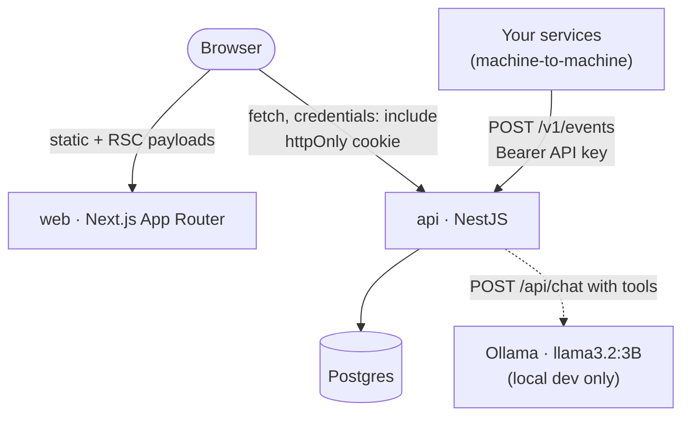
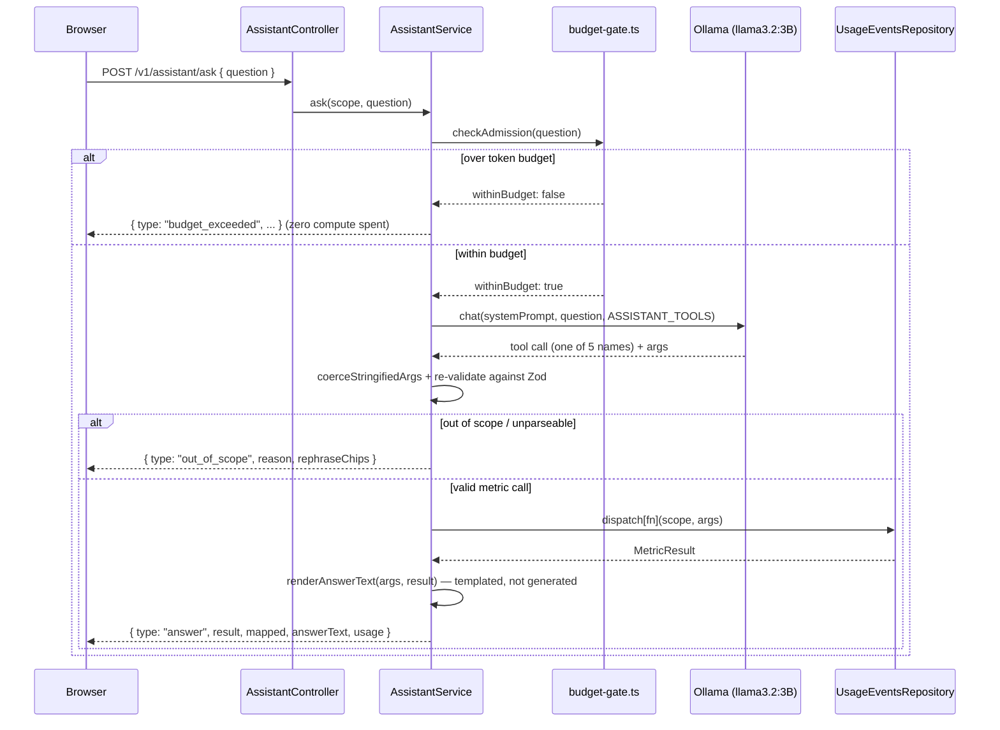
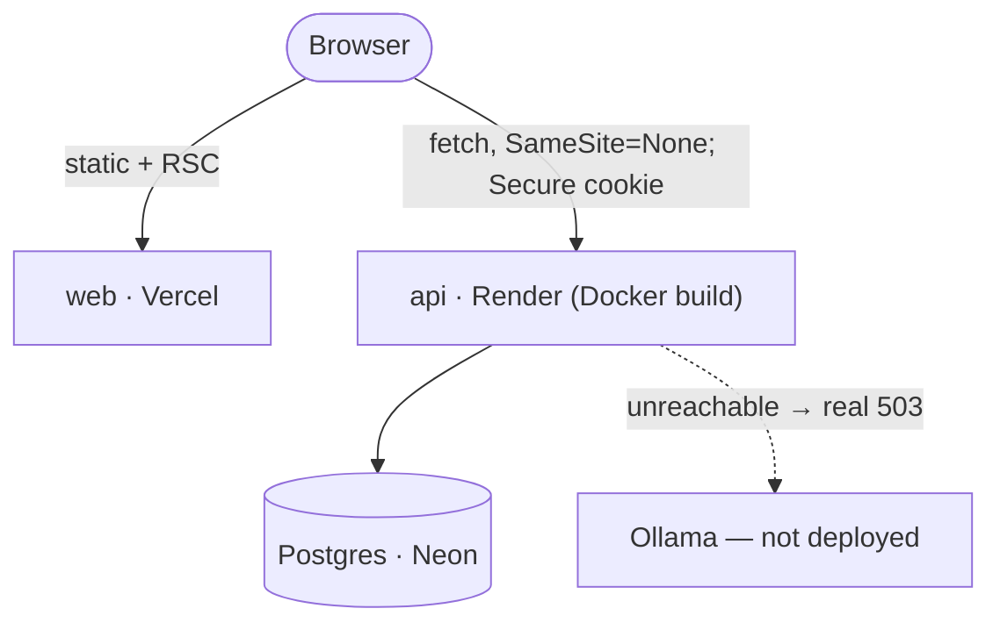

# Architecture

This is the deep-dive companion to the README's architecture summary — read that first for the one-screen version. This doc exists so a new engineer can understand *how a request actually moves through the system* without reading the source tree cold.

For **why** any of this looks the way it does, the [ADRs](./adr/README.md) are the source of truth — this doc describes the shape that resulted, not the reasoning behind it. Where a decision is non-obvious, it links the ADR rather than re-arguing it.

## System components

```
apps/
  api        NestJS — auth, ingestion, usage aggregation, budgets, the NL-query assistant
  web        Next.js (App Router) — Statement, Budgets, the ask bar and answer log
packages/
  sdk        Reserved for a published ingestion client — currently an empty stub
  ui         Reserved for extracted shared components — currently an empty stub
```

See [folder-structure.md](./folder-structure.md) for what's inside each of those.

Two runtime processes in local dev (`apps/api` on :3000, `apps/web` on :3001), plus Postgres and, only for the assistant, a local Ollama daemon. In production the same two processes run as separate managed services with no reachable Ollama — see [deployment-guide.md](./deployment-guide.md) and [ADR-0005](./adr/0005-deploy-topology-and-the-production-ollama-boundary.md).



The browser talks to `api` directly — `web` never proxies API calls through a Next.js route handler. That's a deliberate simplicity choice (one fewer layer to reason about) with one real cost: web and API are two different origins even in local dev conceptually, and genuinely cross-*site* in production, which is why the auth cookies need the `COGENT_CROSS_SITE_COOKIES` toggle (below).

## Request lifecycle — an authenticated read

Walking `GET /api/v1/usage/statement` end to end, because every other authenticated GET/POST in the app follows the identical shape:

1. **Browser** sends `fetch(..., { credentials: 'include' })`. The `cogent_access` httpOnly cookie rides along automatically.
2. **CORS** (`main.ts`) checks the request's `Origin` against `WEB_ORIGIN` — an explicit allow-list, not a wildcard, because a wildcard can't be combined with `credentials: true`.
3. **`AuthGuard`** (`apps/api/src/auth/auth.guard.ts`) reads the cookie, verifies the JWT's HS256 signature (`auth/jwt.ts`), and — only on success — calls `scopeFromVerifiedClaims()` (`db/scope.ts`) to produce a `TenantScope`. This is the *only* place in the codebase permitted to construct one.
4. **`ZodValidationPipe`** parses the query string against the route's Zod schema (`usage/dto/statement-query.dto.ts`). Invalid input never reaches the controller.
5. **Controller** (`UsageController.statement`) pulls `scope` off the request and passes it as the mandatory first argument to the repository call. There is no code path where a controller reads an org id from the request body or query string — no DTO in the app has an `orgId` field.
6. **Repository** (`UsageEventsRepository.getStatement`) composes its SQL predicate with `orgScope(usageEvents.orgId, scope)` (`db/scoped-query.ts`). Every read and write in the data layer goes through this same helper.
7. **Response** goes back through Nest's serialization, no ORM entities or password hashes ever in the shape.

The load-bearing property: **tenant isolation is enforced at the query layer (step 6), not the route (step 3).** A route guard alone would be enough for every HTTP-originated call — but the NL-query assistant (below) calls the same repositories directly, as a non-HTTP caller. If isolation only lived in a guard, the assistant's data access would need to reinvent it. Putting the check where every caller — HTTP or not — is forced through it is the actual reason for the design, not "guards are bypassable" (they aren't). Full argument: [ADR-0001](./adr/0001-hand-rolled-jwt-and-org-scoped-rbac.md).

## Auth model

Hand-rolled, not a library, and hybrid rather than "stateless JWT everywhere":

| Token | Lifetime | Storage | Purpose |
|---|---|---|---|
| Access token | 15 min | httpOnly cookie `cogent_access`, `Path=/` | Signature-only verification on every request (`auth/jwt.ts`) — no DB round-trip on the hot path |
| Refresh token | Until rotated/revoked | httpOnly cookie `cogent_refresh`, `Path=/api/auth`, DB-backed (`refresh_tokens` table) | Opaque, SHA-256-hashed at rest; rotation with reuse detection — presenting an already-consumed token revokes the whole token family |

On every `/api/auth/refresh`, `org` and `role` are **re-read from the `memberships` table**, not copied forward from the old token's claims. That's what makes a role change or org removal take effect within one refresh cycle (≤15 min) with no denylist infrastructure. The residual — a already-issued access token stays valid for up to 15 minutes after a revocation — is named and accepted, not hidden; the designed-but-not-built escalation (a Redis `jti` denylist) is in [roadmap.md](./roadmap.md).

Machine-to-machine ingestion (`POST /v1/events`) uses a **separate credential type entirely** — a bearer API key minted once at signup, hashed the same way as refresh tokens, checked by `ApiKeyGuard` rather than `AuthGuard`. No human session is involved, and the org is resolved from the key, never the payload.

Full reasoning, including why HS256 over RS256 and the timing-attack mitigation on login: [ADR-0001](./adr/0001-hand-rolled-jwt-and-org-scoped-rbac.md).

## The NL-query assistant

The differentiator, and the part worth the most interview depth. Full detail: [ADR-0003](./adr/0003-nl-query-guardrails.md) (the shape) and [ADR-0004](./adr/0004-nl-query-assistant-function-calling-intent-and-cost-cap.md) (the binding, plus its load-bearing amendment).



The properties that make this safe rather than "an LLM with database access":

- **The tool set *is* the allow-list.** Exactly five tools reach the model — four metric functions (`getSpend`, `getRequestVolume`, `getLatency`, `getErrorRate`) and one control tool (`report_out_of_scope`). There is no sixth path.
- **The model never sees `orgId`.** `scope` is applied by the server after dispatch, from the same verified credential every other route uses — never a value the model's output can supply. Worst case, a prompt-injected question steers the model to a different *in-scope* query; that's the accepted residual, made visible via the `mapped:` tag on every answer.
- **The model's arguments are re-validated, not trusted.** `coerceStringifiedArgs` repairs a known Ollama quirk (nested objects returned as a JSON string), then `metricArgsSchema.safeParse` — the exact same Zod schema the HTTP `/v1/usage/*` routes validate against — is the actual gate. There is no code path where model output becomes SQL directly.
- **`intent` (`point` vs `slice`) is derived server-side** from whether `groupBy` is present, never asserted by the model.
- **Answers are templated, not generated.** One model call maps the question to a function+args; a server-side template (`answer-template.ts`) renders the figure from the real query result. The model never phrases the number.
- **The cost ceiling is a compute budget, not a dollar figure.** A pre-compute token-count admission check runs *before* Ollama is touched — over-budget means zero compute spent, not spent-then-refused — plus a measured 45s wall-clock timeout for what can't be bounded a priori. This replaced an earlier dollar-per-query design; the amendment in [ADR-0004](./adr/0004-nl-query-assistant-function-calling-intent-and-cost-cap.md) records why the original premise (a paid hosted API) was wrong for this project and how the guardrail was re-derived.

## Deployed topology

Three managed services, one of which the browser never talks to directly:



Because web and API are genuinely cross-site in this topology, both auth cookies flip to `SameSite=None; Secure` via `COGENT_CROSS_SITE_COOKIES=true`. No Ollama runs in production — the assistant returns its real degraded state rather than a faked answer or a hidden feature. Full reasoning and the free-tier RAM/idle-suspend numbers behind it: [ADR-0005](./adr/0005-deploy-topology-and-the-production-ollama-boundary.md). Operational how-to: [deployment-guide.md](./deployment-guide.md).

## Data model summary

One tenant-scope column (`orgId`) on every scoped table, money as integer micro-dollars throughout, Postgres chosen deliberately over DynamoDB. Full column-by-column reference: [database-schema.md](./database-schema.md).

## What this doc doesn't cover

- Endpoint-by-endpoint request/response shapes → [api-documentation.md](./api-documentation.md)
- Local setup steps → [setup-guide.md](./setup-guide.md)
- Frontend component inventory → [component-documentation.md](./component-documentation.md)
- Open defects and designed-not-built items → [known-issues.md](./known-issues.md) and [roadmap.md](./roadmap.md)
