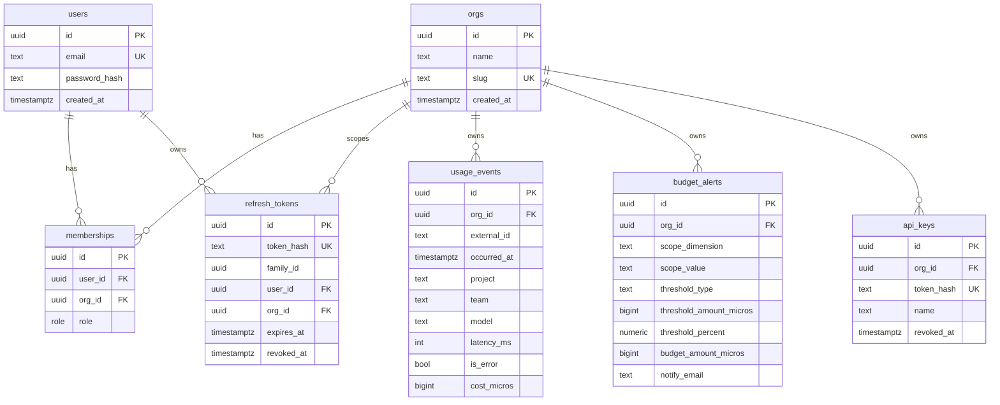

# Database Schema

Postgres, accessed exclusively through [Drizzle ORM](https://orm.drizzle.team/), defined in [`apps/api/src/db/schema.ts`](../apps/api/src/db/schema.ts) — that file is the source of truth; this doc is a reading guide to it, not a replacement. Migrations live in `apps/api/drizzle/` and are generated from schema changes with `npm run db:generate --workspace=apps/api`, applied with `db:migrate`.

**Postgres over DynamoDB was a deliberate choice**, argued in full in [ADR-0002](./adr/0002-usage-event-persistence-single-path-ingestion-and-named-aggregation-layer.md) — named aggregation functions over `usage_events` cover every read this app needs, and choosing not to add a second database was the judgment call, not adding one for its own sake.

## Entity-relationship overview

**The one invariant every table shares**: every scoped table's `org_id` is the *sole* tenant column, and it is never populated from client input anywhere in the codebase — no DTO in `apps/api/src` has an `orgId` field. It's written only from a verified `TenantScope` (`db/scope.ts`), constructed only from a signature-verified JWT or a hash-verified API key. See [architecture.md](./architecture.md#request-lifecycle--an-authenticated-read) for how that flows through a request.

## Tables

### `orgs`

One row per tenant. Uniqueness lives on **`slug`**, not `name` — `"Acme Robotics"` / `"acme robotics"` / `"Acme  Robotics!"` must collide, because that's what a human means by "that name is taken" ([ADR-0001 §Decision-4](./adr/0001-hand-rolled-jwt-and-org-scoped-rbac.md)). `slug` is derived from `name` at signup (`AuthService.slugify`), not client-supplied directly.

| Column | Type | Notes |
|---|---|---|
| `id` | `uuid` PK | |
| `name` | `text` | Display name, as entered at signup |
| `slug` | `text` | Unique index (`orgs_slug_unique`) — the real uniqueness boundary |
| `created_at` | `timestamptz` | |

### `users`

Identity only — **no `org_id` here**. Email is globally unique; one identity can hold memberships in multiple orgs via the join table below. This deliberately departs from a naive `users.org_id` model, which would make the org switcher unreachable ([ADR-0001 §Decision-4](./adr/0001-hand-rolled-jwt-and-org-scoped-rbac.md)).

| Column | Type | Notes |
|---|---|---|
| `id` | `uuid` PK | |
| `email` | `text` | Unique index (`users_email_unique`) |
| `password_hash` | `text` | Argon2 (`@node-rs/argon2`), never a raw or reversibly-encrypted password |
| `created_at` | `timestamptz` | |

### `memberships`

The join table that makes **org-scoping and role a property of a `(user, org)` pair, not of a user**. A JWT's `org`/`role` claims are a *cache* of this row, re-derived on every refresh rather than copied forward — that's what makes a role change or removal take effect within one refresh interval (≤15 min) with no denylist.

| Column | Type | Notes |
|---|---|---|
| `id` | `uuid` PK | |
| `user_id` | `uuid` FK → `users.id`, `ON DELETE CASCADE` | |
| `org_id` | `uuid` FK → `orgs.id`, `ON DELETE CASCADE` | |
| `role` | `enum('owner','member')` | |
| `created_at` | `timestamptz` | |

Unique index on `(user_id, org_id)` — one membership per user per org.

### `refresh_tokens`

Opaque, DB-backed refresh tokens — **never a JWT**. Only the SHA-256 hash of the token is stored, matching the pattern in `api_keys` below (a 256-bit CSPRNG secret has no dictionary to slow-hash against, so a fast hash is fine — unlike passwords).

| Column | Type | Notes |
|---|---|---|
| `id` | `uuid` PK | |
| `token_hash` | `text` | Unique index (`refresh_tokens_hash_unique`) |
| `family_id` | `uuid` | Groups a rotation chain — reusing a `revoked_at` row revokes the whole family |
| `user_id` | `uuid` FK → `users.id`, `ON DELETE CASCADE` | |
| `org_id` | `uuid` FK → `orgs.id`, `ON DELETE CASCADE` | Snapshotted at issuance for audit only — live values come from `memberships` |
| `expires_at` | `timestamptz` | |
| `revoked_at` | `timestamptz`, nullable | |
| `replaced_by` | `uuid`, nullable | Points at the token this one was rotated into |
| `created_at` | `timestamptz` | |

### `usage_events`

One row per LLM API call — the entire ingestion dataset. **`org_id` is the sole tenant-scope column**; every read composes its predicate through `orgScope()` (`db/scoped-query.ts`), never a client-supplied id.

| Column | Type | Notes |
|---|---|---|
| `id` | `uuid` PK | |
| `org_id` | `uuid` FK → `orgs.id`, `ON DELETE CASCADE` | |
| `external_id` | `text` | Client idempotency key — currently used only to reject duplicate `POST`s; present ahead of the designed-not-built async-queue escalation, which would need at-least-once-delivery dedup |
| `occurred_at` | `timestamptz` | When the LLM call happened (not when it was ingested) |
| `project` / `team` / `model` | `text` | The three groupable/filterable dimensions |
| `latency_ms` | `int` | |
| `is_error` | `bool` | |
| `cost_micros` | `bigint` | **Integer micro-dollars, not a float** — `SUM` must be exact on a number whose entire claim is an accurate bill. 1 USD = 1,000,000. See [ADR-0002 §1d](./adr/0002-usage-event-persistence-single-path-ingestion-and-named-aggregation-layer.md) |
| `created_at` | `timestamptz` | |

Indexes: unique on `(org_id, external_id)` (idempotency + tenant scope in one index); `(org_id, occurred_at)` for the time-windowed queries every aggregation function runs.

### `budget_alerts`

One row per alert. Same `org_id`-only tenant discipline as every other table.

| Column | Type | Notes |
|---|---|---|
| `id` | `uuid` PK | |
| `org_id` | `uuid` FK → `orgs.id`, `ON DELETE CASCADE` | |
| `scope_dimension` | `enum('total','project','team','model')` | |
| `scope_value` | `text` | **`''` (never `NULL`) when `scope_dimension = 'total'`** — deliberate: Postgres unique indexes treat every `NULL` as distinct, which would let a client create more than one "total" alert per org past the constraint below. A non-null sentinel keeps one index doing the whole job instead of a nullable column plus a partial index |
| `threshold_type` | `enum('amount','percent')` | |
| `threshold_amount_micros` | `bigint`, nullable | Set in `amount` mode only |
| `threshold_percent` | `numeric(5,2)`, nullable | Set in `percent` mode only |
| `budget_amount_micros` | `bigint`, nullable | Set in `percent` mode only — see note below |
| `notify_email` | `text` | Resolved server-side from the creating user's account email, never client-supplied |
| `created_at` | `timestamptz` | |

`threshold_amount_micros` vs. `threshold_percent`/`budget_amount_micros` are mutually exclusive per row — enforced by the DTO's `superRefine` (application-level), not a DB `CHECK` constraint, matching this codebase's existing pattern of enforcing cross-field shape in Zod rather than the database (see also `metric-query.dto.ts`'s `from < to`).

**`budget_amount_micros` is the one piece of schema this project flagged as genuinely ambiguous** during the build: the UI spec's "% of budget" threshold mode needs a budget figure to divide into, and no such figure exists anywhere else in the data model — there's no standalone "monthly budget" entity. The resolution taken was the narrowest one available: persist the figure directly on the alert row itself, rather than introducing a new `budgets` table for a value only that alert uses. See the project memory / schema.ts comment for the full reasoning if this comes up in an interview — it's a good example of a real ambiguity resolved with the smallest structural change, not the most "complete" one.

Unique index on `(org_id, scope_dimension, scope_value)` — one alert per scope per org.

### `api_keys`

Per-org bearer credential for machine-to-machine ingestion. Same hash-at-rest discipline as `refresh_tokens`.

| Column | Type | Notes |
|---|---|---|
| `id` | `uuid` PK | |
| `org_id` | `uuid` FK → `orgs.id`, `ON DELETE CASCADE` | |
| `token_hash` | `text` | Unique index (`api_keys_token_hash_unique`) — SHA-256, key shown once at signup and never retrievable again |
| `name` | `text` | Currently always `'default'` — minted once per org, at signup |
| `created_at` | `timestamptz` | |
| `revoked_at` | `timestamptz`, nullable | |

## What's not in the schema, on purpose

- **No `jti` denylist table.** The access-token revocation window (≤15 min) is an accepted residual, not closed by a DB table — see [ADR-0001 §1d](./adr/0001-hand-rolled-jwt-and-org-scoped-rbac.md) and [roadmap.md](./roadmap.md) for the designed Redis-backed escalation.
- **No Row-Level Security policies.** Tenant isolation is enforced at the application query layer (`orgScope()`), not RLS — designed as a defense-in-depth escalation, not built. See [ADR-0001 §Decision-3](./adr/0001-hand-rolled-jwt-and-org-scoped-rbac.md).
- **No queue/outbox table for ingestion.** `usage_events` is written synchronously, one row per `POST /v1/events` — the SQS-backed async design is documented but not built ([ADR-0002 §2d](./adr/0002-usage-event-persistence-single-path-ingestion-and-named-aggregation-layer.md)).
