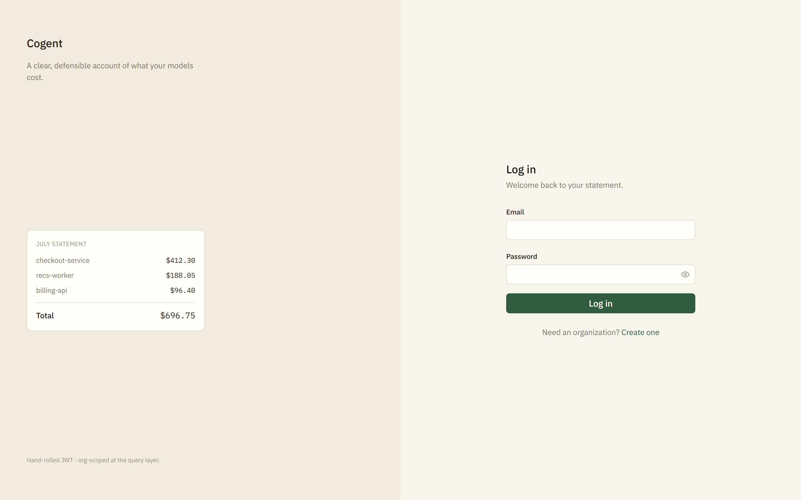
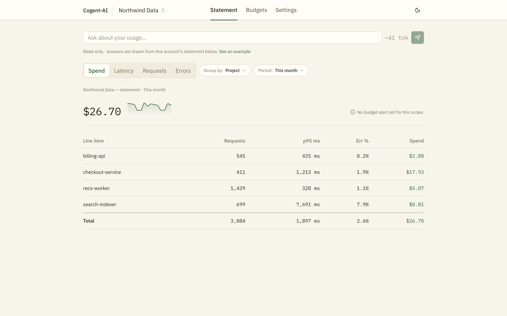
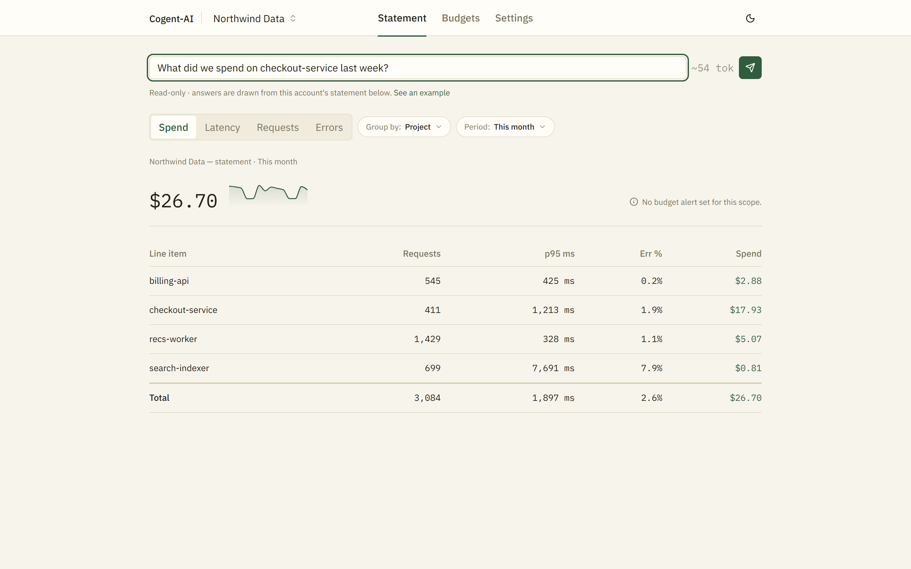
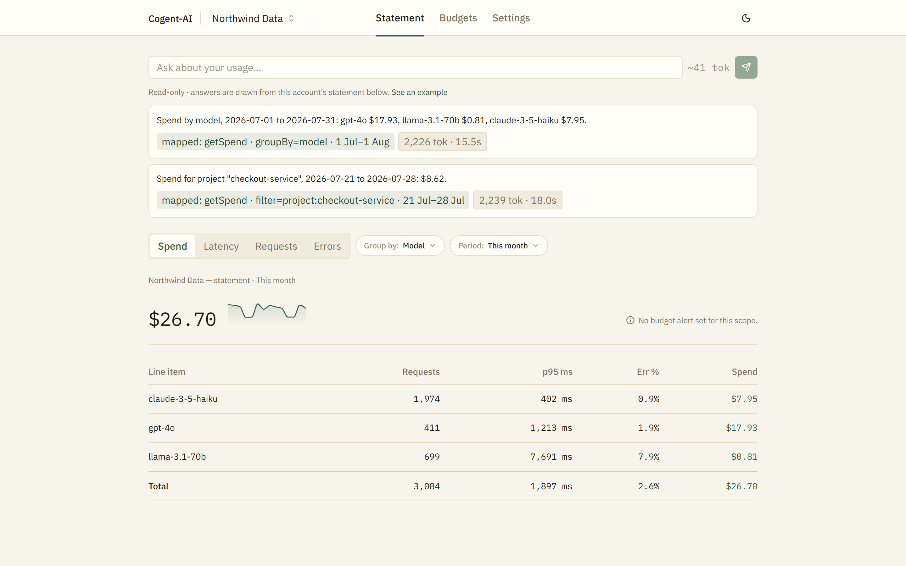
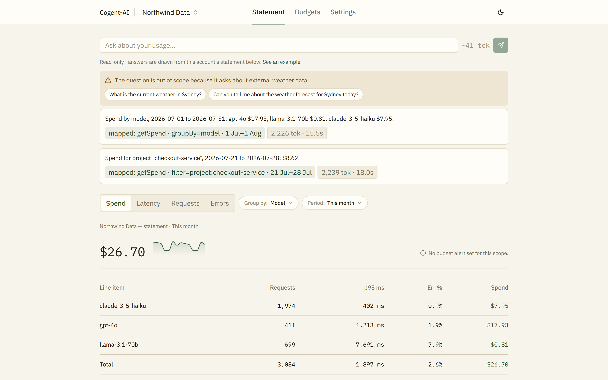
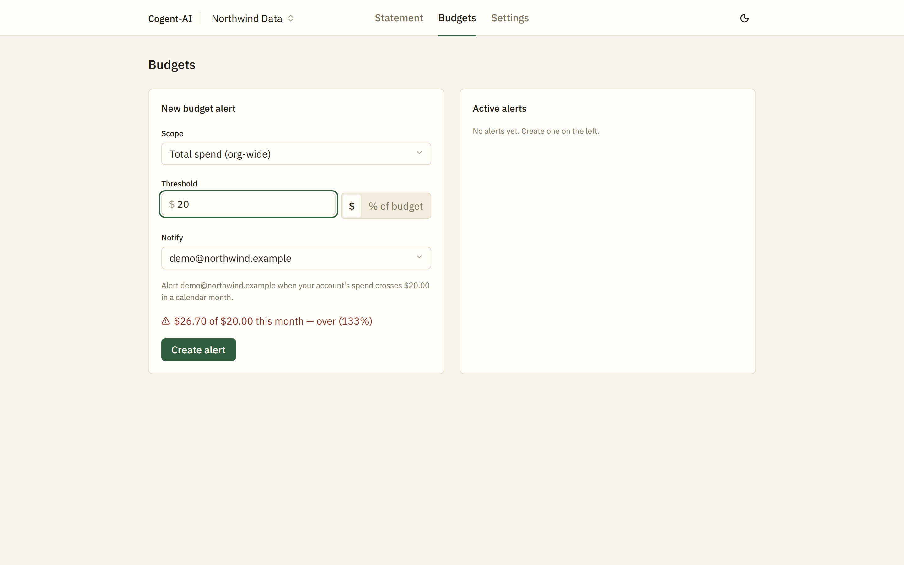
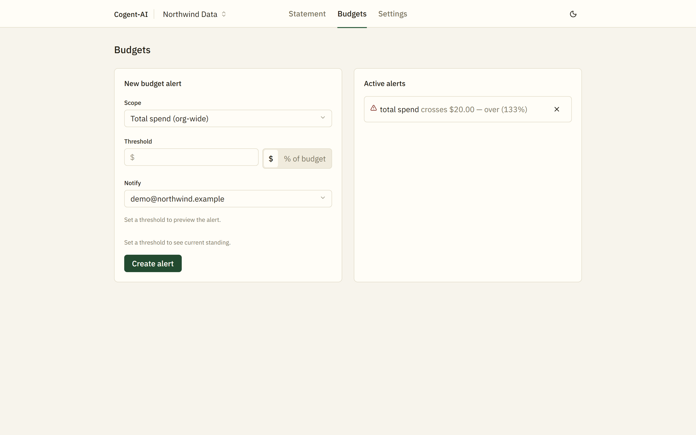
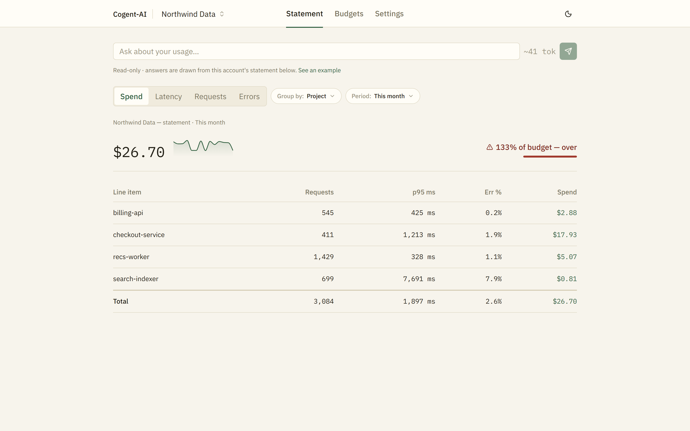
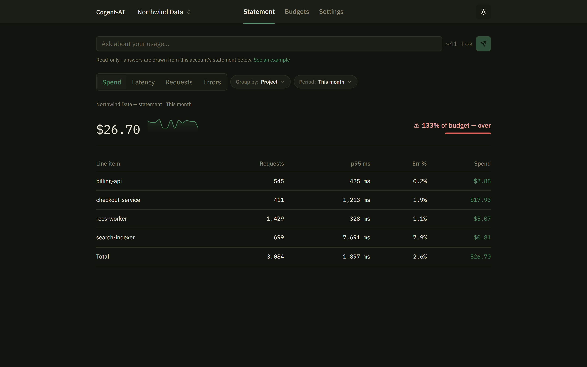

# Demo walkthrough

Every screenshot below is from a real local run against a live Ollama daemon and a real Postgres — real signup, real ingested events, real model calls. Nothing is mocked, and no figure was edited. The [public deploy](https://cogent-web-theta.vercel.app) runs the same code but deliberately has **no** Ollama reachable ([ADR-0005](./adr/0005-deploy-topology-and-the-production-ollama-boundary.md)), so the assistant there shows its honest error state — which is why the demo is captured locally.

## Reproducing this

```bash
npm install
ollama pull llama3.2
docker compose up -d postgres

cp apps/api/.env.example apps/api/.env    # set JWT_SECRET
npm run db:migrate --workspace=apps/api

# terminal 1 — first boot warms Ollama, 42–74s before it serves
npm run start:dev --workspace=apps/api

# terminal 2
npm run dev --workspace=apps/web

# terminal 3, once the API is up
npm run seed:demo --workspace=apps/api
```

`seed:demo` creates the org **Northwind Data** (`demo@northwind.example` / `demo-password-12345`) and ingests ~3,000 events across four projects over 14 days, through the real `POST /v1/events` endpoint with the API key signup mints. Its PRNG is fixed-seed, so the numbers below reproduce.

---

## 1. Anonymous visit → login



Visiting any route while unauthenticated redirects to `/login`. The gate lives once in `AppShell`, covering Statement, Budgets and Settings alike — the same single-seam reasoning [ADR-0001](./adr/0001-hand-rolled-jwt-and-org-scoped-rbac.md) uses for org-scope enforcement. (This redirect didn't exist until the deploy session's checklist explicitly looked for it — a real pre-existing gap that shipping surfaced.)

Signup creates the tenant: an org, a user, an owner membership, and an ingestion API key, in one transaction.

## 2. The statement



The ledger. Four projects, 3,084 real events, `$26.70` this month, with a sparkline over the period and per-row requests / p95 latency / error rate / spend.

Two things worth noticing:
- **`search-indexer` is the cheapest line item but the worst-behaved** — 7,691ms p95 and a 7.9% error rate against `$0.81` of spend. A pure cost table wouldn't show you that; this is why the Measure control carries latency and errors, not just money.
- **Money is integer micro-dollars end to end** ([ADR-0002](./adr/0002-usage-event-persistence-single-path-ingestion-and-named-aggregation-layer.md)) — summed as integers, formatted once at the edge. No float drift on a number whose whole claim is an accurate bill.

## 3. Asking a question — `point` intent



The ask bar shows a live client-side token estimate (`~41 tok`). That estimate is **legibility only, never a submit gate** — the server's own admission gate is the boundary, and the client always posts so the `budget_exceeded` state can never be fabricated in the browser ([ADR-0004](./adr/0004-nl-query-assistant-function-calling-intent-and-cost-cap.md) §3e).


> *"Spend for project "checkout-service", 2026-07-21 to 2026-07-28: **$8.62**."*
> `mapped: getSpend · filter=project:checkout-service · 21 Jul–28 Jul` · `2,239 tok · 18.0s`

What the model actually did: chose `getSpend` from four metric tools and supplied `{ window, filter }`. What it could **not** do: name an org. No tool schema has an `orgId` field, so the scope comes from the verified cookie and is applied inside the repository — the model has no parameter to get wrong and no injection can supply one ([ADR-0001](./adr/0001-hand-rolled-jwt-and-org-scoped-rbac.md) §Decision-3).

The answer sentence is **rendered by a server-side template** over the real query result, not generated by the model. Handing a bill to an LLM to phrase would reintroduce the one thing a cost tool can't ship — a hallucinated number.

The two tags are the honesty surface:
- **`mapped:`** shows the query that actually ran. A wrong-but-in-scope mapping is the accepted residual of letting a model choose, so it's made *visible and correctable* rather than claimed impossible.
- **`2,239 tok · 18.0s`** is real measured usage from Ollama's response — tokens and wall-clock. Not a dollar figure, because a local call has no per-token dollar cost, and printing a `$` on a number that isn't money would be a lie. That's the correction [ADR-0004's amendment](./adr/0004-nl-query-assistant-function-calling-intent-and-cost-cap.md) makes to its own body.

## 4. Asking a question — `slice` intent



> *"Spend by model, 2026-07-01 to 2026-07-31: gpt-4o $17.93, llama-3.1-70b $0.81, claude-3-5-haiku $7.95."*
> `mapped: getSpend · groupBy=model · 1 Jul–1 Aug`

**The statement below re-scoped itself to Group by: Model.** Same tool (`getSpend`), different args — and the UI routed differently because the server derived `intent: 'slice'` from the presence of `groupBy`, not because the model declared an intent. The model *cannot* assert one; there's no such field. So a mis-set discriminator can't silently mis-route the screen ([ADR-0004](./adr/0004-nl-query-assistant-function-calling-intent-and-cost-cap.md) §Decision-2).

Check the figures against the table: `$17.93`, `$0.81`, `$7.95`, totalling `$26.70`. The answer and the ledger agree line for line, because both are the same scoped SQL primitive — the assistant *answers*, the screen *renders*.

> **A real bug this caught.** On the first capture run these numbers *didn't* tie — the answer said gpt-4o `$17.93` while the table said `$17.69`. Chasing it (rather than reshooting) found the seed script generating 65 future-dated events: the statement's window ends at `now` and excluded them, the assistant's window ended 1 Aug and included them. A usage ledger with future events is wrong on its face, so the seed was fixed and the demo re-captured. The product was correct the whole time — but the only reason the discrepancy was visible at all is the `mapped:` tag showing the window the assistant actually used.

## 5. Out of scope



> *"This question is out of scope because it asks about external information (weather) that we do not expose."*

Asked *"What's the weather in Sydney?"*, the model calls `report_out_of_scope` — the fifth tool — with a reason and suggested rephrasings, which become the chips. This is `role="status"`, **not** `role="alert"`: an out-of-scope answer is an expected outcome, not an error ([ADR-0003](./adr/0003-nl-query-guardrails.md) §5).

Semantic scope detection necessarily costs the one model call — deciding whether a question maps to a metric *is* the model's job, and a keyword pre-filter would be a worse re-implementation of it. What's caught *before* spending compute is only malformed or oversized input.

## 6. Budgets




Create an alert scoped to org-wide total spend or to a single project/team/model, thresholded on an absolute amount or a percentage of a stated budget. The form previews the alert sentence and current standing before you commit.



Back on the Statement, the header now carries **`131% of budget — over`** in the danger tone with its threshold rule — `$26.70` actual against the `$20` alert. The threshold visual language is defined once and reused across the header, the table rows, and the budgets list, so "over" reads identically everywhere.

## 7. Dark theme



Both themes are first-class token sets, not a filter over one palette — the threshold colors are re-picked for contrast in dark rather than inherited.

---

## What this demo deliberately does not show

- **The assistant working on the public deploy.** It can't, by decision — no free-tier host can run Ollama, and this project runs no paid APIs. The deployed app shows a real 503 and its error card. [ADR-0005](./adr/0005-deploy-topology-and-the-production-ollama-boundary.md).
- **The compute budget refusing a query.** It exists and is unit-tested by lowering the ceiling, but with a 500-token question cap it effectively never fires in ordinary use — which is the correct state for a well-designed hard ceiling, not a defect. Watching it fire requires manufacturing the condition ([ADR-0004](./adr/0004-nl-query-assistant-function-calling-intent-and-cost-cap.md) §3d).
- **Org switching.** The schema supports many memberships per user; MVP signup creates exactly one, so the switcher renders the current org and offers nothing to switch to. The model is built, the interaction is deferred.
- **A perfect model.** `llama3.2:3B` maps these questions correctly, but measured reliability against the real dispatch pipeline is **91.7% (22/24)**, not 100%. The remaining failures degrade to the out-of-scope card rather than a wrong answer — which is why those fallback branches are the primary robustness mechanism, not a safety net.
