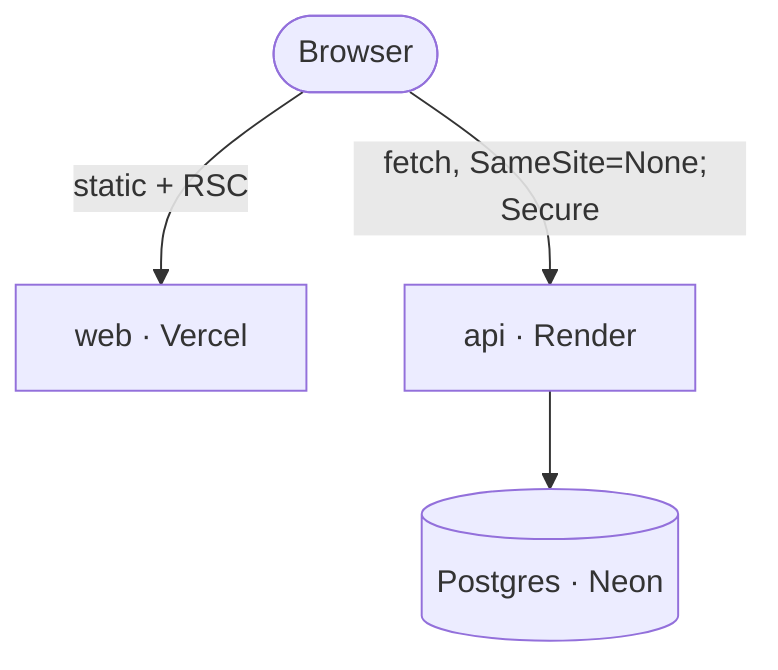

# Deployment Guide

How the live deployment is put together, and how to reproduce or redeploy it. The **why** behind every choice here — especially the no-Ollama-in-production boundary — lives in [ADR-0005](./adr/0005-deploy-topology-and-the-production-ollama-boundary.md); this doc is the operational how-to.

## Live topology

| Service | Host | URL |
|---|---|---|
| Web (Next.js) | Vercel | https://cogent-web-theta.vercel.app |
| API (NestJS) | Render (Docker build) | https://cogent-api.onrender.com |
| Database | Neon (managed Postgres) | — |

No Ollama runs anywhere in this deployment, on purpose — see the "No Ollama in production" section below.



## Deploying the API (Render)

The API ships as a Docker image, built from **[`apps/api/Dockerfile`](../apps/api/Dockerfile)**. Two things about it matter for anyone redeploying:

1. **Build context is the repo root**, not `apps/api/` — Render's Docker builds default to the repo root, and this is an npm-workspaces monorepo, so `npm ci` needs the root lockfile (it lists every workspace). Only `apps/api/package.json` is copied in alongside root config, so only that workspace is built into the image.
2. **The container's entrypoint is `node apps/api/dist/src/main.js`, not `dist/main.js`.** `nest build` (no explicit tsconfig `rootDir` override) emits `dist/src/main.js`. This was found by actually running the built image — the more obvious `dist/main` (matching `start:prod`'s script) is wrong for this project's tsconfig and would fail at container boot with a "cannot find module" error.

Render service configuration (dashboard, not committed as IaC in this repo):

- **Runtime**: Docker, root `Dockerfile` path `apps/api/Dockerfile`
- **Environment variables**: every row in [environment-variables.md](./environment-variables.md)'s `apps/api` table, with production-specific values:
  - `DATABASE_URL` — the Neon pooled connection string
  - `JWT_SECRET` — a real random secret, distinct from any local `.env`
  - `WEB_ORIGIN` — the exact Vercel URL, `https://cogent-web-theta.vercel.app`
  - `COGENT_CROSS_SITE_COOKIES` — `true` (web and API are on different registrable domains, so cookies need `SameSite=None; Secure` to survive the round trip — see [ADR-0005 §Decision-1](./adr/0005-deploy-topology-and-the-production-ollama-boundary.md))
  - `COGENT_OLLAMA_BASE_URL` / `COGENT_OLLAMA_MODEL` — left at their defaults or unset; nothing is listening there in this environment, which is the point
  - `NODE_ENV=production`
- **Free tier caveat**: Render's free tier spins the service down when idle. The first request after a quiet period takes 10–15s to cold-start the container itself, on top of any Ollama-related latency (there is none, since Ollama isn't reachable).

## Deploying the web app (Vercel)

Standard Vercel Next.js deploy, rooted at `apps/web`. The one setting that matters beyond Vercel's defaults:

- **`NEXT_PUBLIC_API_URL`** must point at the deployed API **including the `/api` prefix** — `https://cogent-api.onrender.com/api`. This exact variable, missing its `/api` suffix, was one of the four real bugs found only by deploying (below). Because `NEXT_PUBLIC_*` variables are inlined into the client bundle at build time, changing this value requires a new build, not just re-pointing an existing deployment.
- Root directory in the Vercel project settings must be `apps/web` (this is a monorepo — Vercel needs to be told which workspace to build).

## Database (Neon)

A standard managed Postgres instance. After provisioning:

```bash
DATABASE_URL="<neon-pooled-connection-string>" npm run db:migrate --workspace=apps/api
```

run once, from a machine with the production `DATABASE_URL`, to apply the Drizzle migrations before the API's first real request. There's no seed step for production — the live deploy starts empty, and every org that exists on it was created by a real signup.

## No Ollama in production

The NL-query assistant depends on a local Ollama daemon (`llama3.2:3B`). None of the three hosts above run one, and that's a deliberate decision, not a gap:

- Standard free-tier PaaS RAM (e.g. Render free: 512 MB) is roughly an order of magnitude short of what `llama3.2:3B` needs resident in memory.
- Free-tier hosts idle-suspend; every real visitor would pay the measured 42–74s cold-load-plus-tool-grammar-compilation cost as the *normal* case, not an edge case.
- The project's standing rule is no paid APIs anywhere, so swapping to a hosted model "just for prod" was considered and rejected — see [ADR-0005](./adr/0005-deploy-topology-and-the-production-ollama-boundary.md) for the full alternatives-rejected list, including why tunneling back to a local daemon (ngrok/cloudflared) was also rejected.

**The result requires no special deploy-time handling** — `COGENT_OLLAMA_BASE_URL` is simply left pointed at nothing reachable. The failure path was already built correctly for local-dev reasons before deploy was a consideration: `OllamaAssistantClient.onModuleInit()` is a best-effort warm-up (a failed warm-up logs and degrades to first-query latency, it never blocks boot), and every `/v1/assistant/ask` call surfaces a real `ServiceUnavailableException` (503) that the web app renders as `AssistantErrorCard`, not a blank panel or a fabricated answer.

If a future deploy phase wants a working assistant in production, [ADR-0005](./adr/0005-deploy-topology-and-the-production-ollama-boundary.md) names the scoped-and-declined escalation path (an Oracle Cloud Always-Free Ampere A1 instance, sized for this) — recorded as designed-not-built, not ruled out forever. See also [roadmap.md](./roadmap.md).

## CI — what actually gates a merge

[`.github/workflows/ci.yml`](../.github/workflows/ci.yml) runs on every push/PR to `main`: `npm ci` → `lint` → `typecheck` → `build` → `apps/api`'s unit test suite (`npm run test`, mocks only, no live infra).

**Deliberately not run in CI**: `test:e2e` and the `verify:*` scripts. Both need a live Ollama daemon with a 42–131s cold warm-up that a GitHub-hosted runner doesn't provision, and three e2e cases have a pre-existing tracked gap ([known-issues.md](./known-issues.md)) that would either fail CI on missing infrastructure or hide inside 150s of expected-looking flakiness. The workflow file comments this inline rather than leaving a silent gap between what the CI badge implies and what it actually covers. Full reasoning: [ADR README, "What CI actually checks"](./adr/README.md#what-ci-actually-checks).

There is no CD step — Render and Vercel each deploy from their own GitHub integration (push to `main` → their own build), independent of the CI workflow above.

## Verifying a deploy

The checklist actually run against this deployment (from [ADR-0005](./adr/0005-deploy-topology-and-the-production-ollama-boundary.md)'s verification plan), useful as a repeatable smoke test after any redeploy:

1. Sign up on the real public URL; confirm the session cookie is present in DevTools with `HttpOnly`, `Secure`, `SameSite=None`, and that a hard reload keeps the session (not silently anonymous).
2. Hit the assistant with no Ollama reachable; confirm a real `503` and that the UI renders `AssistantErrorCard` (`role="alert"`), not a blank panel.
3. Confirm the API process reaches "listening" and serves other routes normally even though the Ollama warm-up failed at boot.

## Known bugs found only by deploying

Kept here as a reminder that these categories of bug don't show up locally — worth re-checking after any topology change:

- `SameSite=Lax` cookies silently never persisting across genuinely cross-site domains (fixed by `COGENT_CROSS_SITE_COOKIES`).
- `nest build` emitting `dist/src/main.js` while `start:prod` assumed `dist/main` (fixed in the Dockerfile's `CMD`).
- No anonymous-visitor redirect existing anywhere in the app (a gap invisible when you're always logged in locally).
- A deploy env var (`NEXT_PUBLIC_API_URL`) missing the `/api` prefix.
